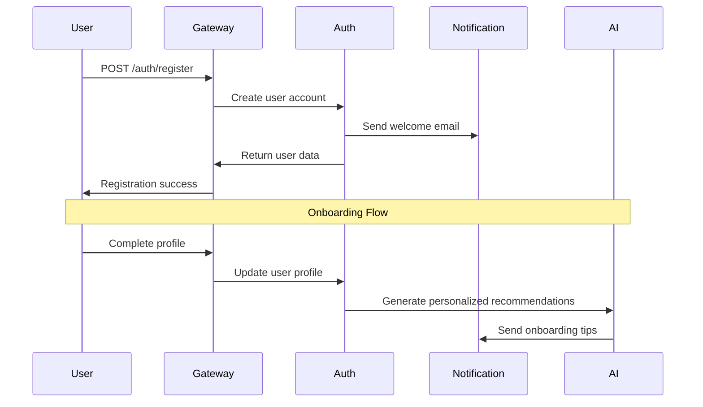
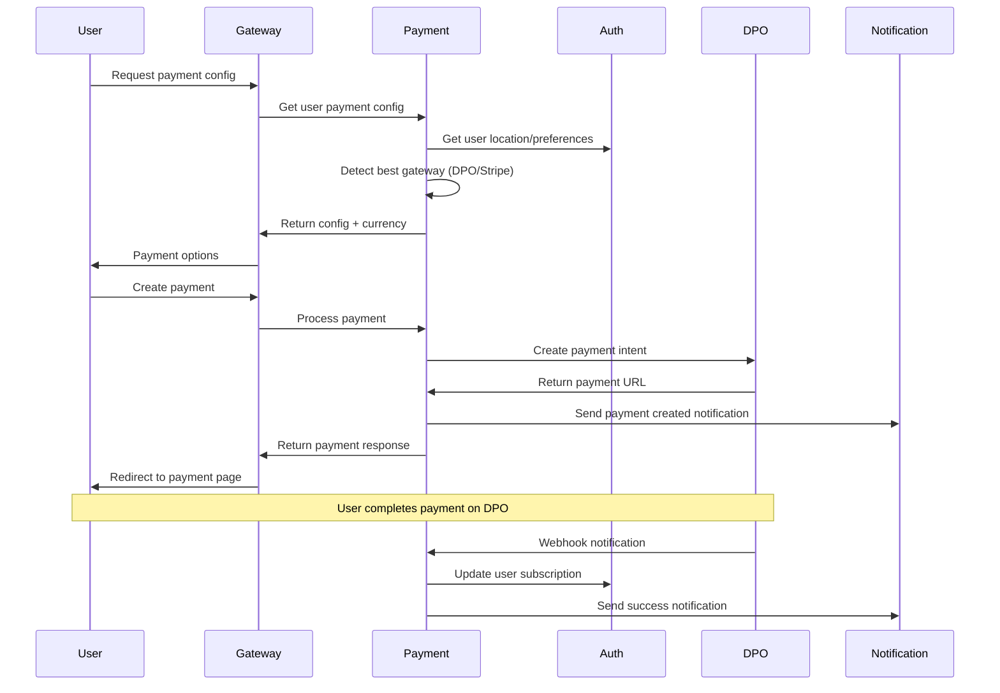
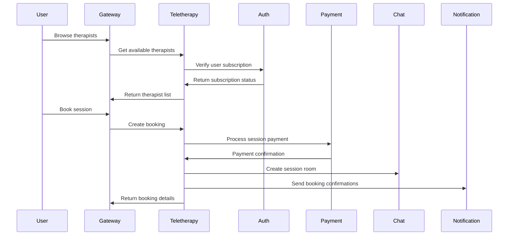
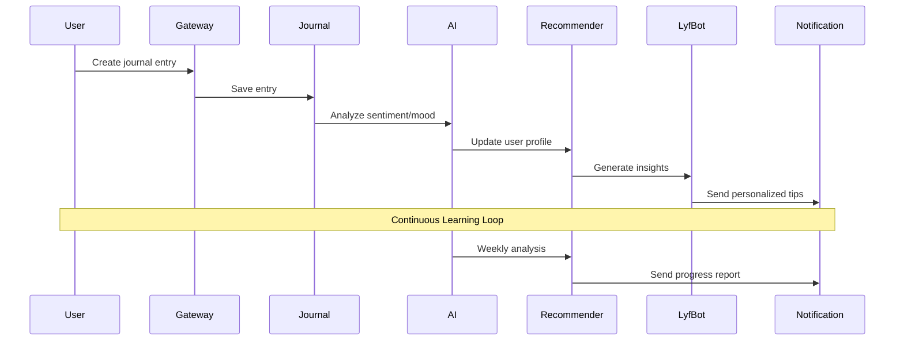

# MindLyfe Service Communication Guide

## 🏗️ Architecture Overview

The MindLyf platform follows a microservices architecture with centralized authentication and distributed business logic. This guide details how services communicate to deliver seamless user experiences.

## 🔄 Core Service Communication Patterns

### 1. Authentication-First Pattern

Every service interaction begins with authentication validation:

```typescript
// Standard authentication flow
Client Request → API Gateway → Auth Service → Target Service
```

**Implementation:**
```typescript
// API Gateway - JWT Validation
@UseGuards(JwtAuthGuard)
async proxyToService(serviceName: string, req: Request) {
  // Token is validated before forwarding
  const userContext = req.user; // Extracted from JWT
  return this.proxyService.forwardRequest(serviceName, req, userContext);
}

// Target Service - User Context Access
@Controller('payments')
export class PaymentController {
  @Post()
  async createPayment(@Request() req: any, @Body() dto: CreatePaymentDto) {
    const userId = req.user.id; // Available in all authenticated requests
    return this.paymentService.createPayment(userId, dto);
  }
}
```

### 2. Service-to-Service Communication Pattern

Services communicate using service tokens for internal operations:

```typescript
// Service Token Authentication
const serviceRequest = {
  headers: {
    'Authorization': `Bearer ${serviceToken}`,
    'X-Service-Name': 'payment-service',
    'Content-Type': 'application/json'
  }
};

// Example: Payment service calling Auth service
async getUserFromAuthService(userId: string): Promise<User> {
  const response = await this.httpService.get(
    `${authServiceUrl}/auth/users/${userId}`,
    { headers: this.getServiceHeaders() }
  );
  return response.data.user;
}
```

### 3. Event-Driven Notification Pattern

Critical events trigger notifications across multiple channels:

```typescript
// Payment Success Flow
Payment Service → Notification Service → User (Email/SMS/Push)
              → Auth Service (Update user status)
              → Frontend (Real-time update)

// Implementation
async handlePaymentSuccess(payment: Payment) {
  // 1. Send notification
  await this.sendNotification(payment.userId, 'payment_succeeded', {
    amount: payment.amount,
    currency: payment.currency
  });
  
  // 2. Update auth service
  await this.notifyAuthService(payment.userId, {
    type: 'payment_succeeded',
    paymentId: payment.id
  });
  
  // 3. Update subscription if applicable
  if (payment.type === 'subscription') {
    await this.updateSubscriptionStatus(payment.userId, 'active');
  }
}
```

## 🎯 User Experience Flows

### 1. User Registration & Onboarding



**Key Features:**
- Immediate email verification
- Progressive profile completion
- AI-powered personalization from day one
- Multi-channel welcome sequence

### 2. Payment Processing Journey



**User Experience Benefits:**
- Automatic currency detection based on location
- Local payment methods (Mobile Money for Africa)
- Real-time payment status updates
- Immediate service activation

### 3. Therapy Session Booking



**Seamless Integration:**
- Subscription status automatically checked
- Payment processed if needed
- Chat room pre-created for session
- Calendar invites sent to both parties

### 4. AI-Powered Mental Health Journey



**Intelligent Features:**
- Real-time mood analysis
- Personalized recommendations
- Proactive mental health tips
- Progress tracking and insights

## 🔧 Service Integration Details

### Auth Service - Central Hub

**Role**: Authentication, authorization, and user management
**Dependencies**: None (core service)
**Integrations**: All services depend on Auth

```typescript
// Key Auth Service Endpoints
POST /auth/validate-token          // Token validation for services
GET  /auth/users/:userId           // User data for services
POST /auth/validate-payment-access // Payment authorization
POST /auth/users/:userId/payment-notification // Payment updates
```

**Communication Pattern:**
```typescript
// All services validate tokens through Auth
class AuthGuard {
  async canActivate(context: ExecutionContext): Promise<boolean> {
    const token = this.extractToken(context);
    const response = await this.httpService.post(
      `${authServiceUrl}/auth/validate-token`,
      { token },
      { headers: this.getServiceHeaders() }
    );
    context.switchToHttp().getRequest().user = response.data.user;
    return true;
  }
}
```

### Payment Service - Financial Operations

**Role**: Payment processing, currency conversion, subscription management
**Dependencies**: Auth, Notification
**Integrations**: DPO Pay, Stripe, Currency APIs

```typescript
// Smart Gateway Selection
async createPayment(userId: string, dto: CreatePaymentDto) {
  // 1. Get user details from Auth
  const user = await this.getUserFromAuthService(userId);
  
  // 2. Detect best payment gateway
  const gateway = await this.detectBestGateway(
    user.country, 
    dto.currency, 
    user.ip
  );
  
  // 3. Process payment
  const payment = await gateway.createPaymentIntent(paymentData);
  
  // 4. Send notifications
  await this.sendNotification(userId, 'payment_created', payment);
  
  return payment;
}
```

**Currency Intelligence:**
```typescript
// Automatic currency detection for African users
async detectUserCurrency(userCountry?: string, userIp?: string): Promise<string> {
  if (userCountry && AFRICAN_COUNTRIES[userCountry]) {
    return AFRICAN_COUNTRIES[userCountry].currency; // UGX, KES, etc.
  }
  
  // IP-based detection as fallback
  if (userIp) {
    const geoData = await this.geoIpService.lookup(userIp);
    return this.getCurrencyForCountry(geoData.country);
  }
  
  return 'UGX'; // Default to Uganda (primary market)
}
```

### Notification Service - Communication Hub

**Role**: Multi-channel notifications (Email, SMS, Push, In-app)
**Dependencies**: Auth
**Integrations**: AWS SES, SMS providers, Push notification services

```typescript
// Intelligent Notification Routing
async sendNotification(userId: string, type: string, data: any) {
  const user = await this.getUserPreferences(userId);
  const template = await this.getTemplate(type, user.language);
  
  // Send via preferred channels
  const channels = this.getChannelsForType(type, user.preferences);
  
  await Promise.allSettled([
    this.sendEmail(user.email, template, data),
    this.sendSMS(user.phone, template, data),
    this.sendPush(user.deviceTokens, template, data),
    this.createInAppNotification(userId, template, data)
  ]);
}
```

**Event-Driven Architecture:**
```typescript
// Payment events trigger multiple notifications
const notificationTypes = {
  payment_created: ['email', 'in_app'],
  payment_succeeded: ['email', 'sms', 'push', 'in_app'],
  payment_failed: ['email', 'in_app'],
  subscription_activated: ['email', 'push'],
  therapy_session_reminder: ['email', 'sms', 'push']
};
```

## 🚀 Performance Optimizations

### 1. Caching Strategy

```typescript
// User data caching across services
@Injectable()
export class UserCacheService {
  async getCachedUser(userId: string): Promise<User> {
    const cacheKey = `user:${userId}`;
    let user = await this.redis.get(cacheKey);
    
    if (!user) {
      user = await this.authService.getUser(userId);
      await this.redis.setex(cacheKey, 300, JSON.stringify(user)); // 5 min cache
    }
    
    return JSON.parse(user);
  }
}
```

### 2. Circuit Breaker Pattern

```typescript
// Resilient service communication
@Injectable()
export class ResilientHttpService {
  private circuitBreaker = new CircuitBreaker(this.makeRequest, {
    timeout: 5000,
    errorThresholdPercentage: 50,
    resetTimeout: 30000
  });

  async makeServiceCall(url: string, data: any): Promise<any> {
    try {
      return await this.circuitBreaker.fire(url, data);
    } catch (error) {
      // Fallback to cached data or default response
      return this.getFallbackResponse(url, data);
    }
  }
}
```

### 3. Request Batching

```typescript
// Batch notifications for efficiency
@Injectable()
export class NotificationBatcher {
  private batchQueue: NotificationBatch[] = [];
  
  @Cron('*/30 * * * * *') // Every 30 seconds
  async processBatch() {
    if (this.batchQueue.length === 0) return;
    
    const batch = this.batchQueue.splice(0, 100); // Process 100 at a time
    await this.sendBatchNotifications(batch);
  }
}
```

## 🔒 Security Patterns

### 1. Zero-Trust Service Communication

```typescript
// Every service call is authenticated and authorized
class ServiceAuthMiddleware {
  async validateServiceRequest(req: Request): Promise<boolean> {
    const serviceToken = req.headers['authorization'];
    const serviceName = req.headers['x-service-name'];
    
    // Validate service token
    const isValid = await this.authService.validateServiceToken(
      serviceName, 
      serviceToken
    );
    
    if (!isValid) {
      throw new UnauthorizedException('Invalid service credentials');
    }
    
    return true;
  }
}
```

### 2. Data Encryption in Transit

```typescript
// All service communications use TLS
const serviceConfig = {
  httpsAgent: new https.Agent({
    rejectUnauthorized: true,
    minVersion: 'TLSv1.2'
  }),
  timeout: 10000
};
```

### 3. Request Validation

```typescript
// Comprehensive input validation
@Injectable()
export class RequestValidator {
  validatePaymentRequest(dto: CreatePaymentDto): void {
    // Amount validation
    if (dto.amount < 50) {
      throw new BadRequestException('Minimum payment amount is 50 cents');
    }
    
    // Currency validation
    if (!this.supportedCurrencies.includes(dto.currency)) {
      throw new BadRequestException(`Currency ${dto.currency} not supported`);
    }
    
    // Sanitize metadata
    dto.metadata = this.sanitizeObject(dto.metadata);
  }
}
```

## 📊 Monitoring & Observability

### 1. Distributed Tracing

```typescript
// Request tracing across services
@Injectable()
export class TracingService {
  createSpan(operationName: string, parentSpan?: Span): Span {
    return this.tracer.startSpan(operationName, {
      childOf: parentSpan,
      tags: {
        service: process.env.SERVICE_NAME,
        version: process.env.SERVICE_VERSION
      }
    });
  }
}
```

### 2. Health Monitoring

```typescript
// Service health checks
@Injectable()
export class HealthService {
  @Get('health')
  async checkHealth(): Promise<HealthStatus> {
    const checks = await Promise.allSettled([
      this.checkDatabase(),
      this.checkRedis(),
      this.checkExternalServices()
    ]);
    
    return {
      status: checks.every(c => c.status === 'fulfilled') ? 'healthy' : 'unhealthy',
      timestamp: new Date(),
      services: this.mapHealthChecks(checks)
    };
  }
}
```

### 3. Performance Metrics

```typescript
// Service performance tracking
@Injectable()
export class MetricsService {
  @Histogram('service_request_duration', 'Service request duration')
  requestDuration: Histogram<string>;
  
  @Counter('service_requests_total', 'Total service requests')
  requestsTotal: Counter<string>;
  
  trackRequest(method: string, endpoint: string, duration: number) {
    this.requestDuration.observe({ method, endpoint }, duration);
    this.requestsTotal.inc({ method, endpoint });
  }
}
```

## 🎯 Best Practices for Optimal User Experience

### 1. Progressive Loading

```typescript
// Load critical data first, then enhance
async getPaymentConfig(userId: string): Promise<PaymentConfig> {
  // 1. Get basic config immediately
  const basicConfig = this.getBasicPaymentConfig();
  
  // 2. Enhance with user-specific data
  const userEnhancements = await Promise.allSettled([
    this.getUserLocation(userId),
    this.getUserPaymentHistory(userId),
    this.getCurrencyRates()
  ]);
  
  return this.mergeConfigs(basicConfig, userEnhancements);
}
```

### 2. Graceful Degradation

```typescript
// Fallback mechanisms for service failures
async createPayment(userId: string, dto: CreatePaymentDto) {
  try {
    // Try primary payment gateway
    return await this.primaryGateway.createPayment(dto);
  } catch (error) {
    this.logger.warn('Primary gateway failed, trying fallback');
    
    // Fallback to secondary gateway
    return await this.fallbackGateway.createPayment(dto);
  }
}
```

### 3. Real-time Updates

```typescript
// WebSocket integration for live updates
@WebSocketGateway()
export class PaymentGateway {
  @SubscribeMessage('payment_status')
  async handlePaymentStatusRequest(client: Socket, paymentId: string) {
    const payment = await this.paymentService.getPayment(paymentId);
    client.emit('payment_update', payment);
    
    // Subscribe to future updates
    this.subscribeToPaymentUpdates(client, paymentId);
  }
}
```

## 🔄 Continuous Improvement

### 1. A/B Testing Framework

```typescript
// Feature flag system for gradual rollouts
@Injectable()
export class FeatureToggleService {
  async isFeatureEnabled(userId: string, feature: string): Promise<boolean> {
    const userSegment = await this.getUserSegment(userId);
    const rolloutPercentage = await this.getFeatureRollout(feature);
    
    return this.isUserInRollout(userSegment, rolloutPercentage);
  }
}
```

### 2. Performance Optimization

```typescript
// Automatic performance tuning
@Injectable()
export class PerformanceOptimizer {
  @Cron('0 2 * * *') // Daily at 2 AM
  async optimizePerformance() {
    const metrics = await this.getPerformanceMetrics();
    
    if (metrics.averageResponseTime > 500) {
      await this.enableCaching();
    }
    
    if (metrics.errorRate > 0.01) {
      await this.increaseRetryAttempts();
    }
  }
}
```

## 📋 Service Communication Checklist

### ✅ Implementation Checklist

- [x] **Authentication**: All services validate JWT tokens
- [x] **Authorization**: Service-to-service authentication implemented
- [x] **Error Handling**: Graceful error handling with fallbacks
- [x] **Monitoring**: Health checks and performance metrics
- [x] **Security**: TLS encryption and input validation
- [x] **Caching**: Redis caching for performance
- [x] **Rate Limiting**: Protection against abuse
- [x] **Logging**: Comprehensive audit trails

### 🔄 Continuous Monitoring

- [x] **Service Health**: Automated health checks
- [x] **Performance Metrics**: Response time and throughput monitoring
- [x] **Error Tracking**: Centralized error logging
- [x] **User Experience**: Real-time user journey tracking
- [x] **Security Events**: Authentication and authorization monitoring

## 🎯 Conclusion

The MindLyf service communication architecture is designed for:

1. **Reliability**: Circuit breakers and fallback mechanisms
2. **Security**: Zero-trust service communication
3. **Performance**: Caching and request optimization
4. **Scalability**: Microservices with horizontal scaling
5. **User Experience**: Real-time updates and progressive loading

This architecture ensures that users receive a seamless, secure, and responsive experience across all platform features, from authentication to payment processing to mental health services.