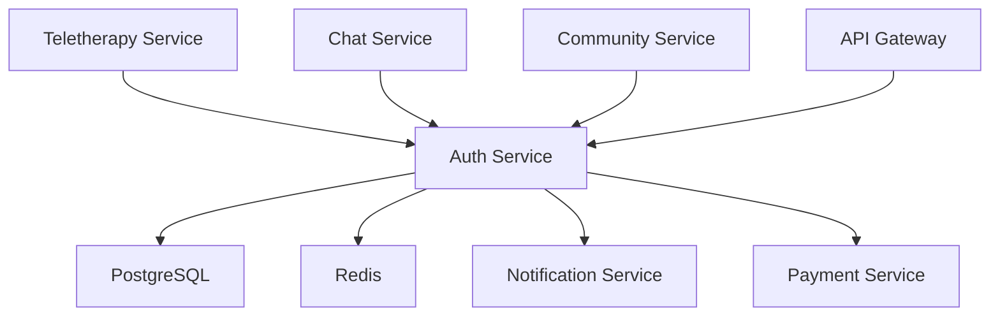

# 🔐 MindLyf Authentication Service

## 🌟 Overview

The MindLyf Authentication Service is a **production-ready, enterprise-grade** microservice built with NestJS that serves as the central authentication and authorization hub for the MindLyf mental health platform. It provides secure, scalable, and HIPAA-compliant user management with advanced security features.

## ✨ Key Features

### 🔑 **Core Authentication**
- **User Registration** - Email-based account creation with verification
- **Secure Login** - JWT-based authentication with refresh tokens
- **Multi-Factor Authentication (MFA)** - TOTP and SMS-based 2FA
- **Password Management** - Reset, change, and strength validation
- **Session Management** - Multiple device sessions with selective logout

### 👤 **User Management**
- **Profile Management** - Comprehensive user information and preferences
- **Role-Based Access Control** - User, therapist, admin roles with granular permissions
- **Account Verification** - Email verification and account activation
- **Privacy Controls** - Data access and deletion requests (GDPR compliance)

### 🔒 **Advanced Security**
- **JWT Tokens** - RS256 signed tokens with automatic rotation
- **Rate Limiting** - Protection against brute force attacks
- **Audit Logging** - Comprehensive security event tracking
- **Device Management** - Track and manage user devices
- **IP Whitelisting** - Enhanced security for sensitive accounts

### 🏢 **Enterprise Features**
- **Multi-tenant Architecture** - Organization-based user isolation
- **Subscription Management** - Payment and billing integration
- **Admin Controls** - Organization-level user management
- **Compliance** - HIPAA and GDPR compliance features

## 🏗️ Architecture

### **Technology Stack**
- **Framework**: NestJS with TypeScript
- **Database**: PostgreSQL with TypeORM
- **Caching**: Redis for session management
- **Authentication**: JWT with RS256 signing
- **Rate Limiting**: Redis-based throttling
- **Validation**: Class-validator with custom rules

### **Service Dependencies**


## 🚀 **Quick Start**

### **Prerequisites**
- Node.js 18+
- PostgreSQL 13+
- Redis 6+
- Docker & Docker Compose

### **Development Setup**
```bash
# Clone the repository
git clone https://github.com/mindlyf/backend.git
cd backend/auth-service

# Install dependencies
npm install

# Set up environment variables
cp .env.example .env

# Start dependencies with Docker
docker-compose up postgres redis -d

# Run database migrations
npm run migration:run

# Start the service in development mode
npm run start:dev
```

### **Docker Setup**
```bash
# Start all services
docker-compose up -d

# View logs
docker-compose logs auth-service -f

# Access the service
curl http://localhost:3001/api/health
```

## 📚 **API Documentation**

### **Interactive Documentation**
- **Swagger UI**: http://localhost:3001/api/docs
- **JSON Schema**: http://localhost:3001/api-docs-json
- **Postman Collection**: Available in `/docs/postman/`

### **Core Endpoints**

#### **🔐 Authentication**
```bash
# Register a new user
curl -X POST http://localhost:3001/api/auth/register \
  -H "Content-Type: application/json" \
  -d '{
    "email": "user@mindlyf.com",
    "password": "SecurePass123!",
    "firstName": "John",
    "lastName": "Doe",
    "role": "client"
  }'

# Login
curl -X POST http://localhost:3001/api/auth/login \
  -H "Content-Type: application/json" \
  -d '{
    "email": "user@mindlyf.com",
    "password": "SecurePass123!"
  }'

# Refresh token
curl -X POST http://localhost:3001/api/auth/refresh-token \
  -H "Content-Type: application/json" \
  -d '{
    "refreshToken": "your-refresh-token"
  }'
```

#### **👤 User Management**
```bash
# Get user profile (requires JWT)
curl -X GET http://localhost:3001/api/auth/me \
  -H "Authorization: Bearer your-jwt-token"

# Update profile
curl -X PATCH http://localhost:3001/api/auth/me \
  -H "Authorization: Bearer your-jwt-token" \
  -H "Content-Type: application/json" \
  -d '{
    "firstName": "Jane",
    "lastName": "Smith"
  }'
```

#### **🔒 Security**
```bash
# Enable MFA
curl -X POST http://localhost:3001/api/auth/mfa/setup \
  -H "Authorization: Bearer your-jwt-token"

# Verify MFA code
curl -X POST http://localhost:3001/api/auth/mfa/verify \
  -H "Content-Type: application/json" \
  -d '{
    "code": "123456",
    "tempToken": "your-temp-token"
  }'
```

## 🔒 **Security Features**

### **Authentication Security**
- **Algorithm**: RS256 (RSA with SHA-256)
- **Access Token Expiry**: 15 minutes
- **Refresh Token Expiry**: 7 days
- **Token Rotation**: Automatic refresh token rotation
- **Password Hashing**: bcrypt with 12 salt rounds

### **Rate Limiting**
- **Login Attempts**: 5 attempts per minute per IP
- **Registration**: 3 registrations per hour per IP
- **Password Reset**: 3 requests per hour per email
- **API Calls**: 100 requests per minute per user

### **Compliance**
- **HIPAA**: Healthcare data protection standards
- **GDPR**: European privacy regulations
- **SOC 2**: Security and availability standards
- **ISO 27001**: Information security management

## 🔗 **Service Integration**

### **Teletherapy Service**
```typescript
// Validate therapist-client relationship
const response = await authService.validateTherapistClient(
  therapistId,
  clientId
);
```

### **Chat Service**
```typescript
// Validate user permissions for chat room
const user = await authService.validateToken(jwtToken);
const hasPermission = await authService.checkChatPermission(
  user.id,
  roomId
);
```

### **Notification Service**
```typescript
// Send welcome email after registration
await notificationService.sendWelcomeEmail(user.email, {
  firstName: user.firstName,
  verificationToken: token
});
```

## 🧪 **Testing**

### **Unit Tests**
```bash
# Run all tests
npm run test

# Run with coverage
npm run test:cov

# Watch mode
npm run test:watch
```

### **Integration Tests**
```bash
# Run e2e tests
npm run test:e2e

# Test specific endpoint
npm run test:e2e -- --grep "auth registration"
```

### **Load Testing**
```bash
# Install k6
brew install k6

# Run load tests
k6 run tests/load/auth-load-test.js
```

## 📊 **Monitoring & Observability**

### **Health Checks**
```bash
# Basic health check
curl http://localhost:3001/api/health

# Detailed health check
curl http://localhost:3001/api/health/detailed
```

### **Metrics**
- **Prometheus**: http://localhost:3001/metrics
- **Custom Metrics**: Authentication rates, error rates, response times
- **Alerts**: Failed login attempts, service downtime

### **Logging**
```bash
# View application logs
docker logs backend-auth-service-1 -f

# Search for specific events
docker logs backend-auth-service-1 | grep "LOGIN_ATTEMPT"
```

## 🚀 **Production Deployment**

### **Environment Configuration**
```bash
# Production environment variables
NODE_ENV=production
PORT=3001

# Database (use managed PostgreSQL)
DB_HOST=your-postgres-host
DB_PORT=5432
DB_USERNAME=auth_user
DB_PASSWORD=secure-password
DB_NAME=mindlyf_auth_prod
DB_SSL=true

# JWT (use strong secrets)
JWT_SECRET=your-256-bit-secret
JWT_ACCESS_EXPIRES_IN=15m
JWT_REFRESH_EXPIRES_IN=7d

# Redis (use managed Redis)
REDIS_HOST=your-redis-host
REDIS_PORT=6379
REDIS_PASSWORD=redis-password
REDIS_TLS=true

# External services
NOTIFICATION_SERVICE_URL=https://notifications.mindlyf.com
PAYMENT_SERVICE_URL=https://payments.mindlyf.com
```

### **Docker Production Build**
```dockerfile
# Multi-stage production build
FROM node:18-alpine AS builder
WORKDIR /app
COPY package*.json ./
RUN npm ci --only=production

FROM node:18-alpine AS production
WORKDIR /app
COPY --from=builder /app/node_modules ./node_modules
COPY dist ./dist
EXPOSE 3001
CMD ["node", "dist/main.js"]
```

### **Kubernetes Deployment**
```yaml
apiVersion: apps/v1
kind: Deployment
metadata:
  name: auth-service
spec:
  replicas: 3
  selector:
    matchLabels:
      app: auth-service
  template:
    metadata:
      labels:
        app: auth-service
    spec:
      containers:
      - name: auth-service
        image: mindlyf/auth-service:latest
        ports:
        - containerPort: 3001
        env:
        - name: NODE_ENV
          value: "production"
        resources:
          requests:
            memory: "256Mi"
            cpu: "250m"
          limits:
            memory: "512Mi"
            cpu: "500m"
```

## 🔧 **Configuration**

### **Environment Variables**
| Variable | Description | Default | Required |
|----------|-------------|---------|----------|
| `NODE_ENV` | Environment mode | `development` | No |
| `PORT` | Service port | `3001` | No |
| `DB_HOST` | PostgreSQL host | `localhost` | Yes |
| `DB_PORT` | PostgreSQL port | `5432` | No |
| `DB_USERNAME` | Database username | `postgres` | Yes |
| `DB_PASSWORD` | Database password | - | Yes |
| `DB_NAME` | Database name | `mindlyf_auth` | Yes |
| `JWT_SECRET` | JWT signing secret | - | Yes |
| `REDIS_HOST` | Redis host | `localhost` | Yes |
| `REDIS_PORT` | Redis port | `6379` | No |

### **Feature Flags**
```typescript
// Enable/disable features via environment
ENABLE_MFA=true
ENABLE_SOCIAL_LOGIN=false
ENABLE_EMAIL_VERIFICATION=true
ENABLE_RATE_LIMITING=true
```

## 🐛 **Troubleshooting**

### **Common Issues**

#### **Database Connection**
```bash
# Check database connectivity
docker exec -it backend-postgres-1 psql -U postgres -d mindlyf_auth -c "SELECT 1;"
```

#### **Redis Connection**
```bash
# Check Redis connectivity
docker exec -it backend-redis-1 redis-cli ping
```

#### **JWT Token Issues**
```bash
# Verify JWT token
curl -X POST http://localhost:3001/api/auth/validate-token \
  -H "Content-Type: application/json" \
  -d '{"token": "your-jwt-token"}'
```

### **Performance Optimization**
- **Database Indexing**: Ensure proper indexes on email, userId
- **Redis Caching**: Cache frequently accessed user data
- **Connection Pooling**: Configure optimal database connections
- **Rate Limiting**: Adjust limits based on usage patterns

## 📈 **Performance Metrics**

### **Benchmarks**
- **Registration**: ~200ms average response time
- **Login**: ~150ms average response time
- **Token Validation**: ~50ms average response time
- **Throughput**: 1000+ requests/second

### **Scaling Guidelines**
- **Horizontal Scaling**: Stateless design allows easy scaling
- **Database**: Use read replicas for read-heavy operations
- **Redis**: Use Redis Cluster for high availability
- **Load Balancing**: Use sticky sessions for refresh tokens

## 🤝 **Contributing**

### **Development Workflow**
1. Fork the repository
2. Create a feature branch
3. Write tests for new functionality
4. Ensure all tests pass
5. Submit a pull request

### **Code Standards**
- **TypeScript**: Strict mode enabled
- **ESLint**: Airbnb configuration
- **Prettier**: Code formatting
- **Husky**: Pre-commit hooks

## 📄 **License**

This project is licensed under the MIT License - see the [LICENSE](LICENSE) file for details.

## 🆘 **Support**

- **Documentation**: https://docs.mindlyf.com/auth-service
- **Issues**: https://github.com/mindlyf/backend/issues
- **Email**: support@mindlyf.com
- **Slack**: #auth-service channel

---

**Built with ❤️ by the MindLyf Team** 