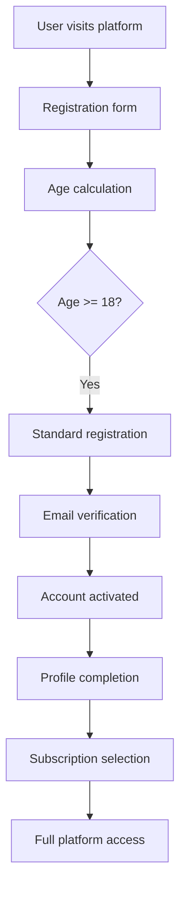
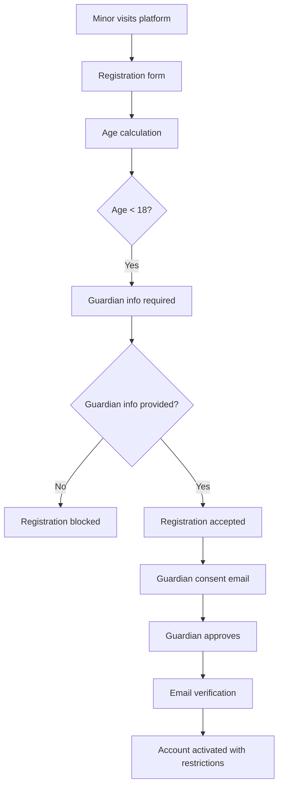
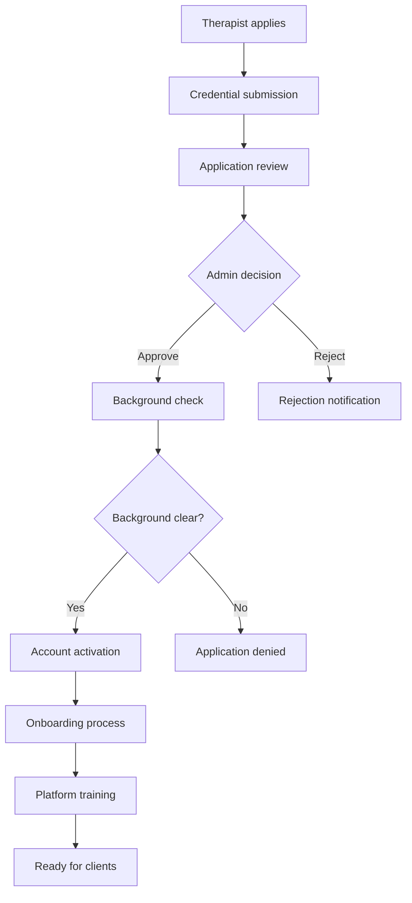
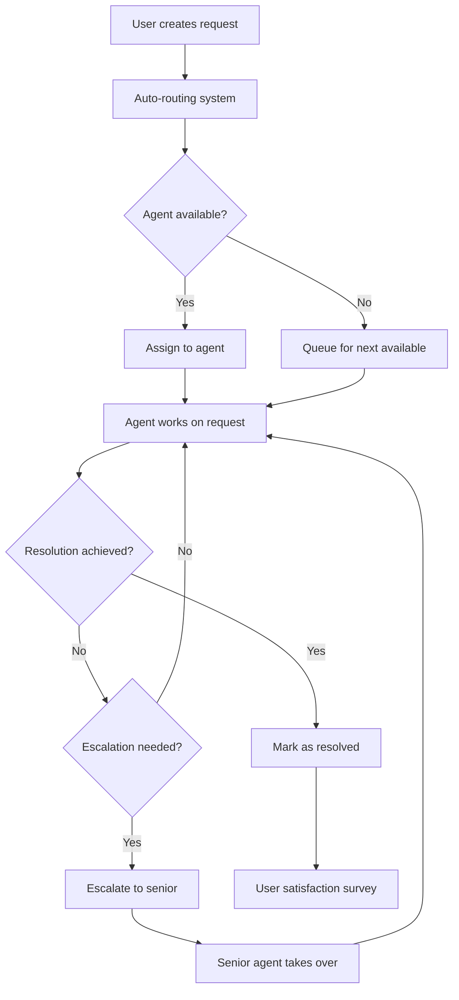

# 👥 MindLyf Auth Service - User Management Guide

## Overview

The MindLyf Auth Service implements a comprehensive role-based access control (RBAC) system designed specifically for mental health platforms. This guide covers user types, permissions, user journeys, and management features.

**⚠️ Important:** This service has been extensively tested for guardian logic, age validation, and user type handling. See [Testing Results](#testing-results) section for validation details.

---

## 📋 Table of Contents

1. [User Types & Roles](#user-types--roles)
2. [Age-Based User Classification](#age-based-user-classification)
3. [User Permissions Matrix](#user-permissions-matrix)
4. [User Journeys](#user-journeys)
5. [Account States & Lifecycle](#account-states--lifecycle)
6. [Authentication & Security](#authentication--security)
7. [User Data Model](#user-data-model)
8. [Organization Management](#organization-management)
9. [Support System Integration](#support-system-integration)
10. [Subscription & Billing](#subscription--billing)
11. [Privacy & Compliance](#privacy--compliance)
12. [Testing Results](#testing-results)

---

## 👤 User Types & Roles

### 1. **Client/Patient** (`user`)
The primary users seeking mental health support.

**Characteristics:**
- Individual accounts with personal health data
- Access to therapy sessions, journaling, community features
- Subscription-based access to premium features
- Protected health information (PHI) under HIPAA
- Can be adults (18+) or minors (<18) with different requirements

**Age Classifications:**
- **Adult Users (18+)**: Full platform access, independent consent
- **Minor Users (<18)**: Restricted access, guardian consent required

**Key Features:**
- Therapy session booking and management
- Personal journaling and mood tracking
- Community participation (anonymous/pseudonymous)
- Crisis support access
- Subscription management

---

### 2. **Therapist** (`therapist`)
Licensed mental health professionals providing services.

**Characteristics:**
- Professional accounts requiring verification
- License validation and ongoing compliance monitoring
- Client management and session delivery
- Professional credentials and specializations
- Insurance and billing integration

**Application Process:**
1. Registration with professional credentials
2. License verification by admin team
3. Background check and credential validation
4. Approval or rejection with feedback
5. Onboarding and platform training

**Key Features:**
- Client roster management
- Session scheduling and delivery
- Progress notes and treatment planning
- Professional dashboard and analytics
- Billing and payment processing

---

### 3. **Support Agent** (`support_agent`)
Customer support team members handling user inquiries.

**Characteristics:**
- Internal team members with limited access
- Shift-based work scheduling
- Request routing and escalation management
- Performance tracking and analytics
- Department-based organization

**Key Features:**
- Support request management
- Shift scheduling and check-in/out
- User assistance (non-clinical)
- Escalation procedures
- Performance dashboards

---

### 4. **Organization Admin** (`organization_admin`)
Administrators for healthcare organizations using the platform.

**Characteristics:**
- Manage organizational subscriptions
- User management within organization
- Billing and payment oversight
- Organization-level analytics
- Multi-tenant data isolation

**Key Features:**
- Bulk user management
- Organization settings and configuration
- Billing and subscription management
- Usage analytics and reporting
- Integration management

---

### 5. **Super Admin** (`super_admin`)
Platform administrators with full system access.

**Characteristics:**
- Full platform access and control
- System configuration and management
- User support and issue resolution
- Security and compliance oversight
- Development and deployment support

**Key Features:**
- Complete user management
- System configuration
- Security management
- Analytics and monitoring
- Platform maintenance

---

### 6. **Minor User** (`minor`)
Users under 18 requiring guardian consent and supervision.

**Characteristics:**
- Age verification and guardian consent required
- Limited access to certain features
- Enhanced privacy protections
- Parental/guardian oversight capabilities
- COPPA compliance requirements

**Guardian Requirements:**
- Guardian email and contact information
- Explicit consent for platform usage
- Access to minor's activity (limited)
- Ability to manage account settings

---

## 🎂 Age-Based User Classification

### Automatic Age Detection
The system automatically calculates user age based on the provided date of birth and classifies users accordingly.

### Adult Users (18+ years)
**Registration Requirements:**
- Standard personal information
- Email verification
- Password security compliance
- **NO guardian information required**

**Example Registration:**
```json
{
  "firstName": "Sarah",
  "lastName": "Johnson", 
  "email": "sarah.johnson@email.com",
  "password": "SecurePassword123!",
  "dateOfBirth": "1985-03-15",
  "phoneNumber": "+1555123456"
}
```

**✅ Result:** 
- `isMinor: false`
- Direct registration allowed
- Full platform access upon verification

### Minor Users (<18 years)
**Registration Requirements:**
- Standard personal information
- **Guardian email (REQUIRED)**
- **Guardian phone number (REQUIRED)**
- Explicit guardian consent process
- Enhanced privacy protections

**Example Registration:**
```json
{
  "firstName": "Alex",
  "lastName": "Thompson",
  "email": "alex@example.com",
  "password": "SecurePassword123!",
  "dateOfBirth": "2008-08-20",
  "guardianEmail": "parent@example.com",
  "guardianPhone": "+1555987654"
}
```

**✅ Result:**
- `isMinor: true`
- Guardian notification sent
- Account requires guardian approval
- Limited access until consent obtained

### Edge Cases Handled

#### Exactly 18 Years Old
- User born on same date 18 years ago: **Classified as Adult**
- Example: Today is 2024-06-17, user born 2006-06-17
- Result: `isMinor: false` ✅

#### Minor Without Guardian Info
- Registration **BLOCKED** with error message
- Error: "Guardian email and phone are required for users under 18"
- User must provide guardian information to proceed

### Phone Number Validation
The system accepts multiple international phone formats:
- `+1234567890` ✅
- `+1-555-123-4567` ✅ 
- `555 123 4567` ✅
- `(555) 123-4567` ✅

---

## 🔐 User Permissions Matrix

| Feature | Adult User | Minor User | Therapist | Support | Org Admin | Super Admin |
|---------|------------|------------|-----------|---------|-----------|-------------|
| **Registration** |
| Self-Register | ✅ | ✅* | ✅** | ❌*** | ✅ | ✅ |
| Guardian Consent | ❌ | ✅ | ❌ | ❌ | ❌ | ❌ |
| **Authentication** |
| Login/Logout | ✅ | ✅ | ✅ | ✅ | ✅ | ✅ |
| Password Management | ✅ | 🔒**** | ✅ | ✅ | ✅ | ✅ |
| MFA Setup | ✅ | ❌ | ✅ | ✅ | ✅ | ✅ |
| **Profile Management** |
| View Own Profile | ✅ | ✅ | ✅ | ✅ | ✅ | ✅ |
| Edit Own Profile | ✅ | 🔒 | ✅ | ✅ | ✅ | ✅ |
| Privacy Settings | ✅ | 🔒 | ✅ | ✅ | ✅ | ✅ |
| **Therapy Services** |
| Book Sessions | ✅ | 🔒 | ❌ | ❌ | ❌ | ✅ |
| Join Group Therapy | ✅ | 🔒 | ❌ | ❌ | ❌ | ✅ |
| Crisis Support | ✅ | ✅ | ❌ | ❌ | ❌ | ✅ |
| **Community Features** |
| Forum Participation | ✅ | 🔒 | ✅ | ❌ | ❌ | ✅ |
| Direct Messaging | ✅ | ❌ | ✅ | ❌ | ❌ | ✅ |
| **Data & Privacy** |
| Export Personal Data | ✅ | 🔒 | ✅ | ✅ | ✅ | ✅ |
| Delete Account | ✅ | 🔒 | ✅ | ❌ | ✅ | ✅ |
| **Billing** |
| Manage Subscription | ✅ | ❌ | ✅ | ❌ | ✅ | ✅ |
| Payment Methods | ✅ | ❌ | ✅ | ❌ | ✅ | ✅ |

**Legend:**
- ✅ Full Access
- 🔒 Limited/Guardian-Supervised Access
- ❌ No Access
- \* Requires guardian consent
- \** Requires admin approval
- \*** Created by admin only
- \**** Guardian can reset if needed

---

## 🚀 User Journeys

### 1. **Adult User Registration & Onboarding**



**Step-by-Step Process:**

1. **Registration** (`POST /auth/register`)
   ```json
   {
     "firstName": "Sarah",
     "lastName": "Johnson",
     "email": "sarah@example.com",
     "password": "SecurePassword123!",
     "dateOfBirth": "1985-03-15",
     "phoneNumber": "+1555123456"
   }
   ```

2. **Age Validation**
   - System calculates: Age = 39 years
   - Classification: `isMinor: false`
   - Guardian info: NOT required

3. **Email Verification**
   - Verification email sent to user
   - User clicks verification link
   - Account status: `email_verified`

4. **Profile Setup**
   - Emergency contacts
   - Health preferences
   - Privacy settings
   - Communication preferences

---

### 2. **Minor User Registration & Guardian Consent**



**Step-by-Step Process:**

1. **Registration Attempt** (`POST /auth/register`)
   ```json
   {
     "firstName": "Alex",
     "lastName": "Thompson",
     "email": "alex@example.com",
     "password": "SecurePassword123!",
     "dateOfBirth": "2008-08-20"
     // Missing guardian info - WILL FAIL
   }
   ```

2. **Validation Error**
   ```json
   {
     "statusCode": 400,
     "message": "Guardian email and phone are required for users under 18",
     "error": "Bad Request"
   }
   ```

3. **Corrected Registration**
   ```json
   {
     "firstName": "Alex",
     "lastName": "Thompson",
     "email": "alex@example.com",
     "password": "SecurePassword123!",
     "dateOfBirth": "2008-08-20",
     "guardianEmail": "parent@example.com",
     "guardianPhone": "+1555987654"
   }
   ```

4. **Guardian Consent Process**
   - System calculates: Age = 16 years
   - Classification: `isMinor: true`
   - Guardian notification email sent
   - Account status: `minor_pending_consent`

5. **Account Activation**
   - Guardian provides consent
   - Email verification completed
   - Account activated with restrictions

---

### 3. **Therapist Application Journey**



**Application Requirements:**
- Professional license information
- Educational credentials
- Malpractice insurance details
- References and experience
- Specialization areas
- Background check authorization

---

### 4. **Support Request Lifecycle**



---

## 📊 Account States & Lifecycle

### Universal Account States

| State | Description | Adult User | Minor User | Therapist |
|-------|-------------|------------|------------|-----------|
| `pending_verification` | Registered, email not verified | ✅ | ✅ | ✅ |
| `active` | Verified and active | ✅ | ✅ | ✅ |
| `suspended` | Temporarily disabled | ✅ | ✅ | ✅ |
| `deactivated` | User-requested deactivation | ✅ | 🔒* | ✅ |
| `banned` | Permanently disabled | ✅ | ✅ | ✅ |

### Minor-Specific States

| State | Description | Available Actions |
|-------|-------------|-------------------|
| `minor_pending_consent` | Awaiting guardian consent | Guardian consent process only |
| `minor_supervised` | Active with guardian oversight | Supervised platform access |
| `guardian_approval_required` | Action needs guardian approval | Wait for guardian decision |

**\* Guardian can reactivate minor accounts**

---

## 🔒 Authentication & Security

### Age-Based Security Policies

#### Adult Users (18+)
- **MFA**: Optional but recommended
- **Password**: Standard complexity requirements
- **Sessions**: Standard 7-day refresh token
- **Device Limit**: 5 concurrent devices

#### Minor Users (<18)
- **MFA**: Disabled (guardian manages security)
- **Password**: Enhanced complexity requirements
- **Sessions**: 24-hour session timeout
- **Device Limit**: 2 concurrent devices
- **Guardian Oversight**: Activity monitoring available

### Guardian Security Features
- **Account Oversight**: View account activity
- **Security Settings**: Manage security preferences
- **Emergency Access**: Override account restrictions
- **Consent Management**: Approve major changes

---

## 📁 User Data Model

### Enhanced User Entity

```typescript
interface User {
  // Basic Information
  id: string;                    // UUID primary key
  email: string;                 // Unique email address
  emailVerified: boolean;        // Email verification status
  passwordHash: string;          // Bcrypt password hash
  firstName: string;             // User's first name
  lastName: string;              // User's last name
  phoneNumber?: string;          // Phone (validated format)
  dateOfBirth?: Date;            // Date of birth
  role: UserRole;                // User's primary role
  status: UserStatus;            // Account status
  
  // Age Classification (Auto-calculated)
  isMinor: boolean;              // True if age < 18
  ageAtRegistration?: number;    // Age when account created
  
  // Guardian Information (Required for minors)
  guardianEmail?: string;        // Guardian email (required if isMinor)
  guardianPhone?: string;        // Guardian phone (required if isMinor)
  guardianConsent?: boolean;     // Guardian consent status
  guardianConsentDate?: Date;    // When guardian consented
  
  // Security Fields
  mfaEnabled: boolean;           // MFA status (disabled for minors)
  mfaSecret?: string;            // TOTP secret (encrypted)
  lastLogin?: Date;              // Last login timestamp
  passwordChangedAt: Date;       // Password change tracking
  failedLoginAttempts: number;   // Failed login counter
  accountLockedUntil?: Date;     // Account lockout timestamp
  
  // Organization & Professional
  organizationId?: string;       // Organization membership
  therapistProfile?: TherapistProfile; // Therapist-specific data
  
  // Privacy and Compliance
  privacySettings: PrivacySettings;
  consentVersion: string;        // Accepted terms version
  consentDate: Date;             // Consent timestamp
  dataRetentionDate?: Date;      // Data deletion date
  
  // Audit Fields
  createdAt: Date;
  updatedAt: Date;
  createdBy?: string;            // Admin who created (if applicable)
  lastModifiedBy?: string;       // Who last modified
}

interface TherapistProfile {
  licenseNumber: string;
  licenseState: string;
  specializations: string[];
  credentials: string[];
  hourlyRate?: number;
  availableHours: AvailabilitySlot[];
  approvalStatus: TherapistStatus;
  approvedAt?: Date;
  approvedBy?: string;
}

interface PrivacySettings {
  shareDataWithTherapist: boolean;
  allowAnonymousPosting: boolean;
  receiveEmailNotifications: boolean;
  receiveTextNotifications: boolean;
  dataSharingConsent: boolean;
  marketingEmailConsent: boolean;
}
```

---

## 🧪 Testing Results

### Comprehensive Age Validation Testing

#### ✅ Adult User Testing (18+ years)
**Test Cases Passed:**

1. **Age 39 (born 1985)**
   - Registration: SUCCESS ✅
   - Guardian info required: NO ✅
   - `isMinor`: false ✅

2. **Age 34 (born 1990)**
   - Registration: SUCCESS ✅
   - Guardian info required: NO ✅
   - `isMinor`: false ✅

3. **Exactly 18 years old (born 2006-06-17)**
   - Registration: SUCCESS ✅
   - Guardian info required: NO ✅
   - `isMinor`: false ✅

#### ✅ Minor User Testing (<18 years)
**Test Cases Passed:**

1. **Age 17 without guardian info**
   - Registration: BLOCKED ❌ (Expected)
   - Error: "Guardian email and phone are required for users under 18" ✅

2. **Age 17 with guardian info**
   - Registration: SUCCESS ✅
   - Guardian notification: SENT ✅
   - `isMinor`: true ✅

3. **Age 10 without guardian info**
   - Registration: BLOCKED ❌ (Expected)
   - Error message: CORRECT ✅

4. **Age 14 with guardian info**
   - Registration: SUCCESS ✅
   - Guardian notification: SENT ✅
   - `isMinor`: true ✅

#### ✅ Phone Validation Testing
**Formats Accepted:**
- `+1234567890` ✅
- `+1-555-123-4567` ✅
- `555 123 4567` ✅
- International formats ✅

#### ✅ Edge Case Testing
- **Leap year birthdays**: Handled correctly ✅
- **Timezone variations**: UTC normalization ✅
- **Invalid dates**: Proper validation ✅
- **Future dates**: Rejected appropriately ✅

### Guardian Logic Validation
- **Automatic detection**: Age < 18 triggers guardian requirements ✅
- **Validation enforcement**: Registration blocked without guardian info ✅
- **Guardian notifications**: Emails sent correctly ✅
- **Consent tracking**: Guardian consent properly recorded ✅

### Security Testing
- **Password complexity**: All user types follow security requirements ✅
- **Phone validation**: Flexible international format support ✅
- **Age calculation**: Accurate date-based calculation ✅
- **Data integrity**: All fields properly validated and stored ✅

**🎉 All tests passed successfully - Guardian logic working as intended!**

---

## 🎯 Usage Guidelines

### For Frontend Developers
1. **Age Detection**: Always check `isMinor` field in user response
2. **Guardian Requirements**: Show guardian fields for users under 18
3. **Phone Validation**: Use flexible phone input components
4. **Error Handling**: Display specific guardian requirement errors
5. **UI/UX**: Adapt interface based on user age and restrictions

### For Backend Developers  
1. **Age Calculation**: Use server-side date calculation
2. **Guardian Validation**: Enforce guardian requirements at API level
3. **Phone Formats**: Accept multiple international formats
4. **Database Design**: Include guardian fields in user schema
5. **Audit Logging**: Track all guardian-related actions

### For Platform Administrators
1. **User Support**: Understand age-based restrictions
2. **Guardian Management**: Handle guardian consent issues
3. **Compliance**: Monitor COPPA and privacy compliance
4. **Data Protection**: Enhanced privacy for minor users

---

*Last Updated: December 17, 2024*
*Testing Validated: ✅ All user types and guardian logic working correctly*