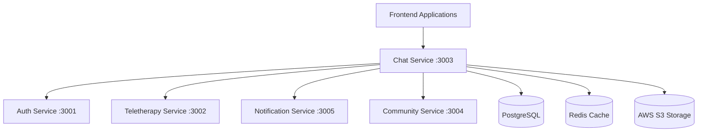

# MindLyf Chat Service

## 🚀 Overview

The **MindLyf Chat Service** is a comprehensive, real-time communication platform designed specifically for mental health and therapy applications. It provides secure messaging, video/audio calling, and community features that prioritize user privacy, therapeutic effectiveness, and HIPAA compliance.

## ✨ Key Features

### 🎯 **Core Communication**
- **Real-time Messaging**: Instant chat with WebSocket support
- **Video/Audio Calling**: Integrated high-quality media calls via MediaSoup SFU
- **Group Therapy**: Moderated group sessions with anonymous participation
- **File Attachments**: Secure file sharing with encryption
- **Message Threading**: Reply to specific messages for organized conversations

### 🔐 **Privacy & Security**
- **End-to-End Encryption**: All communications encrypted
- **Anonymous Messaging**: Optional anonymous participation in groups
- **Identity Management**: Flexible display name options (real/anonymous)
- **HIPAA Compliance**: Healthcare-grade security and audit logging
- **Content Moderation**: Comprehensive reporting and moderation tools

### 🎥 **Advanced Calling Features**
- **MediaSoup Integration**: Professional-grade SFU for optimal media quality
- **WebRTC Support**: Browser-native calling without plugins
- **Screen Sharing**: Share screens during therapy sessions
- **Call Recording**: Optional session recording for documentation
- **Adaptive Quality**: Automatic quality adjustment based on network conditions

### 🤝 **Social & Community**
- **Mutual Follow System**: Privacy-first social connections
- **Support Groups**: Public and private community discussions
- **Therapist-Client Matching**: Secure professional relationships
- **Presence Indicators**: Real-time online status

## 📡 API Documentation

### 🌟 **Live Documentation**
Access the comprehensive, interactive API documentation:

**Development**: http://localhost:3003/api/docs  
**Production**: https://api.mindlyf.com/chat/api/docs

### 🔗 **Quick API Reference**

#### **Authentication**
All endpoints require JWT authentication:
```bash
Authorization: Bearer <your-jwt-token>
```

#### **Core Endpoints**

| Endpoint | Method | Description | Example |
|----------|--------|-------------|---------|
| `/api/health` | GET | Service health check | `GET /api/health` |
| `/api/chat/rooms` | GET | List user's chat rooms | `GET /api/chat/rooms` |
| `/api/chat/rooms` | POST | Create new chat room | `POST /api/chat/rooms` |
| `/api/chat/rooms/{id}/messages` | GET | Get room messages | `GET /api/chat/rooms/123/messages` |
| `/api/chat/rooms/{id}/messages` | POST | Send message | `POST /api/chat/rooms/123/messages` |
| `/api/calling/initiate` | POST | Start video/audio call | `POST /api/calling/initiate` |
| `/api/calling/sessions/{id}/join` | POST | Join call session | `POST /api/calling/sessions/abc/join` |

#### **WebSocket Events**

Connect to: `ws://localhost:3003/socket.io`

| Event | Direction | Description | Payload |
|-------|-----------|-------------|---------|
| `message` | Client → Server | Send chat message | `{roomId, content, isAnonymous}` |
| `message` | Server → Client | Receive chat message | `{id, roomId, senderId, content, timestamp}` |
| `typing` | Client → Server | Typing indicator | `{roomId, isTyping}` |
| `user_typing` | Server → Client | User typing status | `{roomId, userId, isTyping}` |
| `call_incoming` | Server → Client | Incoming call notification | `{sessionId, callerId, callType}` |

## 🏗️ Architecture

### **Service Integration**



### **Key Integrations**

#### **🔐 Auth Service Integration**
- **User Validation**: `GET /api/auth/users/{id}`
- **Permission Checks**: Role-based access control
- **Service Tokens**: Inter-service authentication

#### **📞 Teletherapy Service Integration**
- **Call Sessions**: `POST /api/teletherapy/sessions`
- **WebRTC Transports**: Media stream management
- **Quality Control**: Adaptive bitrate and quality settings

#### **🔔 Notification Service Integration**
- **Real-time Notifications**: Push, email, SMS alerts
- **Message Delivery**: New message notifications
- **Call Alerts**: Incoming call notifications
- **Moderation Alerts**: Content moderation notifications

#### **👥 Community Service Integration**
- **Mutual Follows**: Chat eligibility verification
- **Anonymous IDs**: Privacy-preserving user identities
- **Relationship Validation**: Therapist-client connections

## 🛠️ Development Setup

### **Prerequisites**
- Node.js 18+
- PostgreSQL 14+
- Redis 6+
- Docker (optional)

### **Quick Start**

1. **Install Dependencies**
   ```bash
   npm install
   ```

2. **Environment Configuration**
   ```bash
   cp .env.example .env
   # Edit .env with your configuration
   ```

3. **Database Setup**
   ```bash
   npm run db:migrate
   npm run db:seed
   ```

4. **Start Development Server**
   ```bash
   npm run start:dev
   ```

5. **Access Services**
   - **API**: http://localhost:3003/api
   - **Swagger Docs**: http://localhost:3003/api/docs
   - **Health Check**: http://localhost:3003/health

### **Environment Variables**

```env
# Database
DATABASE_HOST=localhost
DATABASE_PORT=5432
DATABASE_NAME=mindlyf_chat
DATABASE_USERNAME=postgres
DATABASE_PASSWORD=your_password

# Redis
REDIS_HOST=localhost
REDIS_PORT=6379

# JWT
JWT_SECRET=your-secure-jwt-secret

# Service URLs
AUTH_SERVICE_URL=http://auth-service:3001
TELETHERAPY_SERVICE_URL=http://teletherapy-service:3002
NOTIFICATION_SERVICE_URL=http://notification-service:3005
COMMUNITY_SERVICE_URL=http://community-service:3004

# AWS S3 (for file uploads)
AWS_S3_BUCKET=mindlyf-chat-attachments
AWS_ACCESS_KEY_ID=your_access_key
AWS_SECRET_ACCESS_KEY=your_secret_key
AWS_REGION=us-east-1

# Frontend URLs (for CORS)
FRONTEND_URL=http://localhost:3000
ADMIN_URL=http://localhost:3001
```

## 📱 Frontend Integration

### **Real-time Chat Implementation**

```typescript
// Connect to WebSocket
import { io } from 'socket.io-client';

const socket = io('ws://localhost:3003', {
  auth: {
    token: 'your-jwt-token'
  }
});

// Join a chat room
socket.emit('join_room', { roomId: 'room-123' });

// Send a message
socket.emit('message', {
  roomId: 'room-123',
  content: 'Hello everyone!',
  isAnonymous: false
});

// Listen for messages
socket.on('message', (message) => {
  console.log('New message:', message);
});

// Listen for typing indicators
socket.on('user_typing', ({ userId, isTyping }) => {
  console.log(`User ${userId} is ${isTyping ? 'typing' : 'stopped typing'}`);
});
```

### **API Client Example**

```typescript
// Chat API client
class ChatClient {
  private baseUrl = 'http://localhost:3003/api';
  private token: string;

  constructor(token: string) {
    this.token = token;
  }

  private get headers() {
    return {
      'Authorization': `Bearer ${this.token}`,
      'Content-Type': 'application/json'
    };
  }

  // Get chat rooms
  async getRooms() {
    const response = await fetch(`${this.baseUrl}/chat/rooms`, {
      headers: this.headers
    });
    return response.json();
  }

  // Send message
  async sendMessage(roomId: string, content: string, isAnonymous = false) {
    const response = await fetch(`${this.baseUrl}/chat/rooms/${roomId}/messages`, {
      method: 'POST',
      headers: this.headers,
      body: JSON.stringify({ content, isAnonymous })
    });
    return response.json();
  }

  // Initiate call
  async initiateCall(targetUserId: string, callType: 'video' | 'audio', chatRoomId: string) {
    const response = await fetch(`${this.baseUrl}/calling/initiate`, {
      method: 'POST',
      headers: this.headers,
      body: JSON.stringify({ targetUserId, callType, chatRoomId })
    });
    return response.json();
  }
}
```

### **Video Calling Integration**

```typescript
// Video calling with WebRTC
class VideoCallClient {
  private sessionId: string;
  private localStream: MediaStream;
  private remoteStreams: Map<string, MediaStream> = new Map();

  async initiateCall(targetUserId: string, callType: 'video' | 'audio') {
    // 1. Create call session
    const session = await chatClient.initiateCall(targetUserId, callType, roomId);
    this.sessionId = session.sessionId;

    // 2. Get user media
    this.localStream = await navigator.mediaDevices.getUserMedia({
      video: callType === 'video',
      audio: true
    });

    // 3. Join call session
    const joinResult = await fetch(`/api/calling/sessions/${this.sessionId}/join`, {
      method: 'POST',
      headers: chatClient.headers,
      body: JSON.stringify({
        deviceCapabilities: {
          video: callType === 'video',
          audio: true,
          screen: false
        }
      })
    });

    // 4. Setup WebRTC transports
    await this.setupWebRTCTransports();
  }

  private async setupWebRTCTransports() {
    // Create send transport for local media
    const sendTransport = await this.createTransport('send');
    
    // Create receive transport for remote media
    const recvTransport = await this.createTransport('recv');
    
    // Start producing local media
    await this.startProducing(sendTransport);
    
    // Start consuming remote media
    await this.startConsuming(recvTransport);
  }
}
```

## 🧪 Testing

### **Unit Tests**
```bash
npm run test
```

### **Integration Tests**
```bash
npm run test:e2e
```

### **API Testing with Examples**

```bash
# Health check
curl -X GET http://localhost:3003/health

# Get chat rooms (requires auth)
curl -X GET http://localhost:3003/api/chat/rooms \
  -H "Authorization: Bearer YOUR_JWT_TOKEN"

# Send message
curl -X POST http://localhost:3003/api/chat/rooms/ROOM_ID/messages \
  -H "Authorization: Bearer YOUR_JWT_TOKEN" \
  -H "Content-Type: application/json" \
  -d '{"content": "Hello from API!", "isAnonymous": false}'

# Initiate video call
curl -X POST http://localhost:3003/api/calling/initiate \
  -H "Authorization: Bearer YOUR_JWT_TOKEN" \
  -H "Content-Type: application/json" \
  -d '{
    "targetUserId": "user-123",
    "callType": "video",
    "chatRoomId": "room-456"
  }'
```

## 📊 Monitoring & Analytics

### **Health Monitoring**
- **Health Endpoint**: `/health` - Service status and dependencies
- **Metrics**: Request rates, response times, error rates
- **Logging**: Structured JSON logs with correlation IDs

### **Usage Analytics**
- **Message Statistics**: Volume, frequency, engagement metrics
- **Call Analytics**: Duration, quality metrics, usage patterns
- **User Engagement**: Active users, session durations, feature adoption

## 🔒 Security

### **Authentication & Authorization**
- **JWT Tokens**: Secure user authentication
- **Role-based Access**: User, therapist, admin, moderator roles
- **Service-to-Service**: Internal service authentication tokens

### **Data Privacy**
- **Encryption**: All data encrypted in transit and at rest
- **Anonymous Options**: Users can participate anonymously
- **Data Retention**: Configurable message and call data retention
- **GDPR Compliance**: Right to deletion and data portability

### **Content Moderation**
- **Automated Scanning**: AI-powered content filtering
- **Human Review**: Escalation to human moderators
- **Reporting System**: User reporting with investigation workflow
- **Audit Logging**: Complete audit trail for compliance

## 🚀 Deployment

### **Docker Deployment**
```bash
# Build image
docker build -t mindlyf-chat-service .

# Run container
docker run -p 3003:3003 \
  -e DATABASE_HOST=postgres \
  -e REDIS_HOST=redis \
  mindlyf-chat-service
```

### **Production Considerations**
- **Load Balancing**: Multiple service instances behind load balancer
- **Database Scaling**: Read replicas and connection pooling
- **Caching Strategy**: Redis for session management and frequent queries
- **File Storage**: AWS S3 with CDN for attachment delivery
- **Monitoring**: Application performance monitoring and alerting

## 📞 Support

### **Documentation**
- **API Docs**: http://localhost:3003/api/docs
- **Developer Guide**: https://docs.mindlyf.com/chat-service
- **Architecture Guide**: https://docs.mindlyf.com/architecture

### **Contact**
- **Support Email**: support@mindlyf.com
- **Developer Slack**: #mindlyf-developers
- **Issues**: GitHub Issues for bug reports and feature requests

## 📄 License

Proprietary - MindLyf Platform  
© 2024 MindLyf. All rights reserved.

---

**Happy coding! 🎉**

For questions or support, reach out to the MindLyf development team.