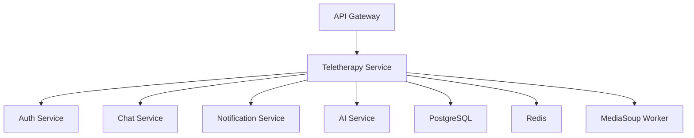

# MindLyf Teletherapy Service

A comprehensive teletherapy platform enabling secure, real-time video, audio, and text-based therapy sessions between therapists and clients. Built with NestJS, PostgreSQL, MediaSoup, and WebRTC technologies.

## 🌟 Features

### Core Functionality
- **Multi-Modal Sessions**: Video, audio, and text-based therapy sessions
- **Session Management**: Scheduling, booking, and comprehensive session lifecycle management
- **Real-time Communication**: WebRTC-powered video/audio with MediaSoup SFU
- **Recording & Transcription**: Secure session recordings and AI-powered transcripts
- **Breakout Rooms**: Support for group therapy with private breakout sessions
- **Calendar Integration**: Seamless scheduling with external calendar systems
- **Follow-up Chat**: Automatic chat room creation for continued support

### Security & Compliance
- **JWT Authentication**: Secure token-based authentication via Auth Service
- **Role-based Access**: Therapist and client role management
- **Data Privacy**: HIPAA-compliant data handling and storage
- **Encrypted Communication**: End-to-end encrypted video/audio streams
- **Audit Logging**: Comprehensive activity logging for compliance

### Advanced Features
- **AI-Powered Insights**: Session analysis and recommendation integration
- **Multi-Platform Support**: Web, mobile, and desktop compatibility
- **Scalable Architecture**: MediaSoup SFU for efficient media routing
- **Real-time Signaling**: WebSocket-based signaling for instant connectivity

## 🏗️ Architecture

### Technology Stack
- **Backend Framework**: NestJS with TypeScript
- **Database**: PostgreSQL with TypeORM
- **Real-time Communication**: WebRTC + MediaSoup SFU
- **Signaling**: Socket.IO WebSockets
- **Authentication**: JWT tokens via Auth Service
- **Media Processing**: FFmpeg for recording processing
- **Container**: Docker with multi-stage builds

### Service Dependencies
The Teletherapy Service integrates with multiple MindLyf platform services:



1. **Auth Service** (`port 3001`)
   - User authentication and authorization
   - Therapist credential validation
   - Client-therapist relationship verification

2. **Chat Service** (`port 3003`)
   - Post-session chat room creation
   - Message history integration

3. **Notification Service** (`port 3005`)
   - Session reminders and alerts
   - Real-time notifications

4. **AI Service** (`port 8000`)
   - Session transcription and analysis
   - Therapy insights and recommendations

## 🚀 Quick Start

### Prerequisites
- Node.js 18+ with npm/yarn
- PostgreSQL 13+
- Redis 6+
- Docker & Docker Compose (recommended)
- Python 3.8+ (for MediaSoup compilation)

### Environment Setup

```bash
# Clone the repository
git clone <repository-url>
cd backend/teletherapy-service

# Install dependencies
npm install

# Copy environment configuration
cp .env.example .env
```

### Environment Variables

```env
# Server Configuration
NODE_ENV=development
PORT=3002

# Database Configuration
DB_HOST=localhost
DB_PORT=5432
DB_USERNAME=postgres
DB_PASSWORD=postgres
DB_NAME=mindlyfe_teletherapy
DB_SYNC=false
DB_LOGGING=false

# JWT Configuration
JWT_SECRET=your-super-secret-jwt-key
JWT_EXPIRES_IN=15m

# MediaSoup Configuration
MEDIASOUP_ANNOUNCED_IP=127.0.0.1
MEDIASOUP_MIN_PORT=10000
MEDIASOUP_MAX_PORT=10100
MEDIASOUP_WORKER_POOL_SIZE=2

# WebRTC Configuration
ICE_SERVERS=[{"urls":"stun:stun.l.google.com:19302"},{"urls":"stun:stun1.l.google.com:19302"}]

# Service URLs
AUTH_SERVICE_URL=http://auth-service:3001
CHAT_SERVICE_URL=http://chat-service:3003
NOTIFICATION_SERVICE_URL=http://notification-service:3005
AI_SERVICE_URL=http://ai-service:8000

# Redis Configuration
REDIS_HOST=localhost
REDIS_PORT=6379
REDIS_PASSWORD=

# Recording Configuration
RECORDINGS_PATH=/app/recordings
RECORDINGS_ENABLED=true
```

### Development Setup

```bash
# Start dependencies (PostgreSQL, Redis)
docker-compose up -d postgres redis

# Run database migrations
npm run migration:run

# Start the service in development mode
npm run start:dev
```

### Docker Deployment

```bash
# Build the service
docker build -t mindlyf/teletherapy-service .

# Run with docker-compose
docker-compose up teletherapy-service
```

## 📋 API Documentation

### Base URL
- **Development**: `http://localhost:3002/api`
- **Via API Gateway**: `http://localhost:3000/api/teletherapy`

### Authentication
All endpoints (except health checks) require JWT authentication:
```
Authorization: Bearer <jwt-token>
```

### Core Endpoints

#### 🏥 Health & Status
```http
GET /api/teletherapy/health
```
**Response**: Service health status, database connectivity, MediaSoup status

#### 🗓️ Session Management

**Create Session**
```http
POST /api/teletherapy/sessions
Content-Type: application/json

{
  "title": "Individual Therapy Session",
  "type": "individual",
  "scheduledStartTime": "2024-01-15T14:00:00Z",
  "scheduledEndTime": "2024-01-15T15:00:00Z",
  "participantIds": ["client-user-id"],
  "description": "Weekly therapy session",
  "metadata": {
    "sessionNotes": "",
    "objectives": ["anxiety management", "coping strategies"]
  }
}
```

**Get Session Details**
```http
GET /api/teletherapy/sessions/{sessionId}
```

**Update Session Status**
```http
PATCH /api/teletherapy/sessions/{sessionId}/status
Content-Type: application/json

{
  "status": "in_progress"
}
```

**Add Session Notes**
```http
PATCH /api/teletherapy/sessions/{sessionId}/notes
Content-Type: application/json

{
  "notes": "Client showed significant progress in anxiety management techniques."
}
```

#### 🎥 Video Session Management

**Join Video Session**
```http
POST /api/video/sessions/{sessionId}/join
Content-Type: application/json

{
  "deviceCapabilities": {
    "video": true,
    "audio": true,
    "screen": true
  }
}
```

**Create WebRTC Transport**
```http
POST /api/video/sessions/{sessionId}/transports
Content-Type: application/json

{
  "direction": "send",
  "rtpCapabilities": {...}
}
```

**Start Media Production**
```http
POST /api/video/sessions/{sessionId}/produce
Content-Type: application/json

{
  "transportId": "transport-uuid",
  "kind": "video",
  "rtpParameters": {...}
}
```

#### 📅 Calendar Integration

**Get Available Slots**
```http
GET /api/calendar/availability?startDate=2024-01-15&endDate=2024-01-22&therapistId=therapist-id
```

**Create Calendar Event**
```http
POST /api/calendar/events
Content-Type: application/json

{
  "title": "Therapy Session",
  "startTime": "2024-01-15T14:00:00Z",
  "endTime": "2024-01-15T15:00:00Z",
  "attendees": ["therapist@example.com", "client@example.com"],
  "metadata": {
    "sessionId": "session-uuid",
    "sessionType": "individual"
  }
}
```

#### 🎙️ Media Session Controls

**Start Recording**
```http
POST /api/media-sessions/{sessionId}/recording/start
```

**Stop Recording**
```http
POST /api/media-sessions/{sessionId}/recording/stop
```

**Get Recording Status**
```http
GET /api/media-sessions/{sessionId}/recording/status
```

#### 📝 Session Booking

**Book Session**
```http
POST /api/sessions/book
Content-Type: application/json

{
  "therapistId": "therapist-uuid",
  "clientId": "client-uuid",
  "sessionType": "individual",
  "scheduledStartTime": "2024-01-15T14:00:00Z",
  "duration": 60,
  "notes": "First session"
}
```

### Response Examples

**Successful Session Creation**
```json
{
  "id": "session-uuid",
  "title": "Individual Therapy Session",
  "type": "individual",
  "status": "scheduled",
  "scheduledStartTime": "2024-01-15T14:00:00Z",
  "scheduledEndTime": "2024-01-15T15:00:00Z",
  "therapistId": "therapist-uuid",
  "participantIds": ["client-uuid"],
  "createdAt": "2024-01-10T10:00:00Z",
  "metadata": {
    "objectives": ["anxiety management", "coping strategies"]
  }
}
```

**Error Response**
```json
{
  "error": "Validation Error",
  "message": "Invalid session type",
  "statusCode": 400,
  "timestamp": "2024-01-10T10:00:00Z",
  "path": "/api/teletherapy/sessions"
}
```

## 🔧 Development

### Project Structure
```
src/
├── auth/              # Authentication module
├── controllers/       # HTTP controllers
├── entities/          # TypeORM entities
├── services/          # Business logic services
├── modules/           # Feature modules
├── interfaces/        # TypeScript interfaces
├── config/           # Configuration files
└── utils/            # Utility functions
```

### Key Services

**MediaSoupService**: Manages WebRTC media routing and SFU functionality
**VideoService**: Handles video session lifecycle and media management
**SessionService**: Core session management and business logic
**CalendarService**: Calendar integration and scheduling
**AuthClientService**: Communication with Auth Service

### Running Tests

```bash
# Unit tests
npm run test

# Integration tests
npm run test:e2e

# Test coverage
npm run test:cov

# Watch mode
npm run test:watch
```

### Development Commands

```bash
# Start in development mode
npm run start:dev

# Build the application
npm run build

# Start production build
npm run start:prod

# Run linting
npm run lint

# Format code
npm run format
```

## 🐳 Docker Configuration

### Multi-Stage Build
The service uses a multi-stage Docker build optimized for production:

```dockerfile
# Development dependencies stage
FROM node:18-alpine as development
RUN apk add --no-cache python3 make g++ cmake

# Production build stage
FROM node:18-alpine as build
COPY --from=development /app/node_modules ./node_modules
RUN npm run build

# Production runtime stage
FROM node:18-alpine as production
COPY --from=build /app/dist ./dist
```

### Docker Compose Integration
```yaml
services:
  teletherapy-service:
    build: .
    ports:
      - "3002:3002"
      - "10000-10100:10000-10100/udp"
    environment:
      - NODE_ENV=production
      - DB_HOST=postgres
    depends_on:
      - postgres
      - redis
    volumes:
      - recordings:/app/recordings
```

## 🛠️ Troubleshooting

### Common Issues

**MediaSoup Compilation Errors**
```bash
# Install build dependencies
npm install --build-from-source
# or in Docker
RUN apk add --no-cache python3 make g++ cmake
```

**Database Connection Issues**
```bash
# Check PostgreSQL connectivity
npm run db:check

# Run migrations manually
npm run migration:run
```

**WebRTC Connection Problems**
- Verify STUN/TURN server configuration
- Check firewall settings for UDP ports 10000-10100
- Ensure MEDIASOUP_ANNOUNCED_IP is correctly set

**JWT Authentication Failures**
- Verify Auth Service is running on port 3001
- Check JWT_SECRET matches across services
- Ensure proper token format: `Bearer <token>`

### Health Checks

**Service Health**
```bash
curl http://localhost:3002/api/teletherapy/health
```

**Database Status**
```bash
curl http://localhost:3002/api/teletherapy/health/db
```

**MediaSoup Worker Status**
```bash
curl http://localhost:3002/api/teletherapy/health/mediasoup
```

### Logs and Monitoring

**View Service Logs**
```bash
# Docker logs
docker logs teletherapy-service -f

# Application logs
tail -f logs/application.log
```

**Common Log Patterns**
- `MediaSoup worker initialized`: MediaSoup is ready
- `Database connected`: PostgreSQL connection established
- `JWT strategy configured`: Authentication is ready
- `WebSocket server listening`: Real-time features available

## 🚢 Deployment

### Production Checklist
- [ ] Environment variables properly configured
- [ ] Database migrations applied
- [ ] SSL certificates configured
- [ ] STUN/TURN servers configured
- [ ] Recording storage configured
- [ ] Health checks enabled
- [ ] Monitoring alerts configured
- [ ] Backup strategy implemented

### AWS ECS Deployment
```json
{
  "family": "mindlyf-teletherapy",
  "cpu": "512",
  "memory": "1024",
  "networkMode": "awsvpc",
  "portMappings": [
    {
      "containerPort": 3002,
      "protocol": "tcp"
    },
    {
      "containerPort": 10000,
      "containerPortRange": "10000-10100",
      "protocol": "udp"
    }
  ]
}
```

### Scaling Considerations
- **Horizontal Scaling**: Multiple service instances with load balancing
- **MediaSoup Workers**: Configure worker pool size based on concurrent sessions
- **Database Connections**: Optimize connection pooling
- **Redis Clustering**: For session state management
- **CDN Integration**: For recording storage and delivery

## 📚 Additional Resources

- [NestJS Documentation](https://docs.nestjs.com/)
- [MediaSoup Documentation](https://mediasoup.org/documentation/)
- [WebRTC Specification](https://webrtc.org/)
- [TypeORM Documentation](https://typeorm.io/)
- [Socket.IO Documentation](https://socket.io/docs/)

## 🤝 Contributing

1. Fork the repository
2. Create a feature branch
3. Implement changes with tests
4. Submit a pull request

## 📄 License

This project is licensed under the MIT License. See LICENSE file for details.